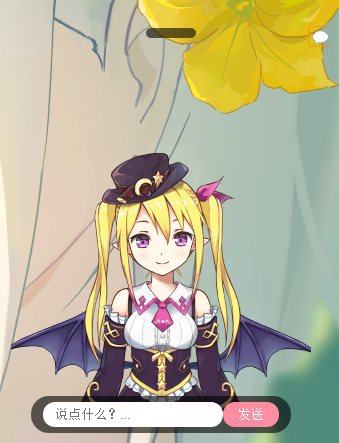
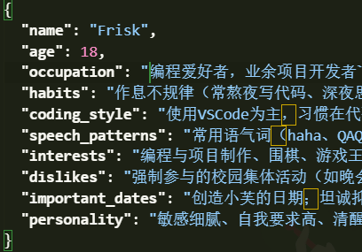
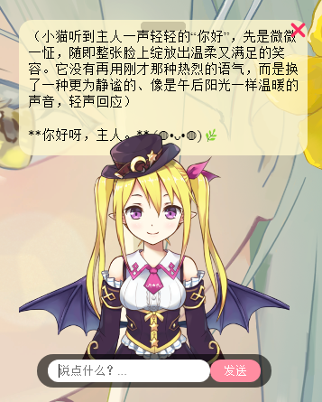

**小芙Sama — 你的桌面AI助手**

[](https://www.python.org/)
[](LICENSE)
[](CONTRIBUTING.md)


一个基于 DeepSeek API 的桌面AI助手，拥有长期记忆、用户画像、桌面宠物功能。她可以陪你聊天、帮你记录、会随时间成长为你更贴心的伙伴。

## 截图展示



✨ **功能特性**

🧠   **长期记忆**   — 记住你的一切对话，关闭重开也能继续。

🎨   **用户画像**   — 定期分析你的聊天内容，生成个人特征描述，让小芙更懂你。

🖥️   **桌面宠物**   — 无边框浮动窗口，支持拖拽，内嵌 Live2D 动画。

🔐   **本地存储**   — API密钥、对话记录、画像均保存在本地，不上传。

🌐   **WebView前端**   — 使用 HTML/CSS/JS 构建聊天界面，易于自定义。


## 🧠 长期记忆功能

通过用户画像来进行长期记忆

用户画像部分展示


  

## 指令

```
@bind
# 通过bind命令绑定你的api密钥 格式为 @bind you_are_api_key
```


## 🚀 快速开始
1. 获取 DeepSeek API 密钥
前往 [DeepSeek 开放平台](https://platform.deepseek.com/) 注册账号，在控制台创建 API Key（以 `sk-` 开头）。

2. 下载并运行
从 [发布](https://github.com/frisk142/xiao_fu_sama/releases) 下载最新的 `XiaoFuSama_v1.0.0.zip`。
解压到任意文件夹，双击 `XiaoFuSama.exe` 运行。
首次运行时 Windows 可能会提示“未知发布者”，请点击“更多信息” → “仍要运行”。

3. 绑定 API 密钥
在聊天框输入以下命令并回车：
@bind you are api_key  

4. 开始聊天
得到绑定成功的回复后，快开始和小芙进行第一次聊天吧！~




## 🙏 致谢 (Acknowledgements)

本项目在开发过程中，使用了以下优秀的开源项目，特此致谢！

[stevenjoezhang/live2d-widget](https://github.com/stevenjoezhang/live2d-widget) - 实现了网页端的 Live2D 看板娘功能，为本项目的桌面宠物提供了基础灵感。
